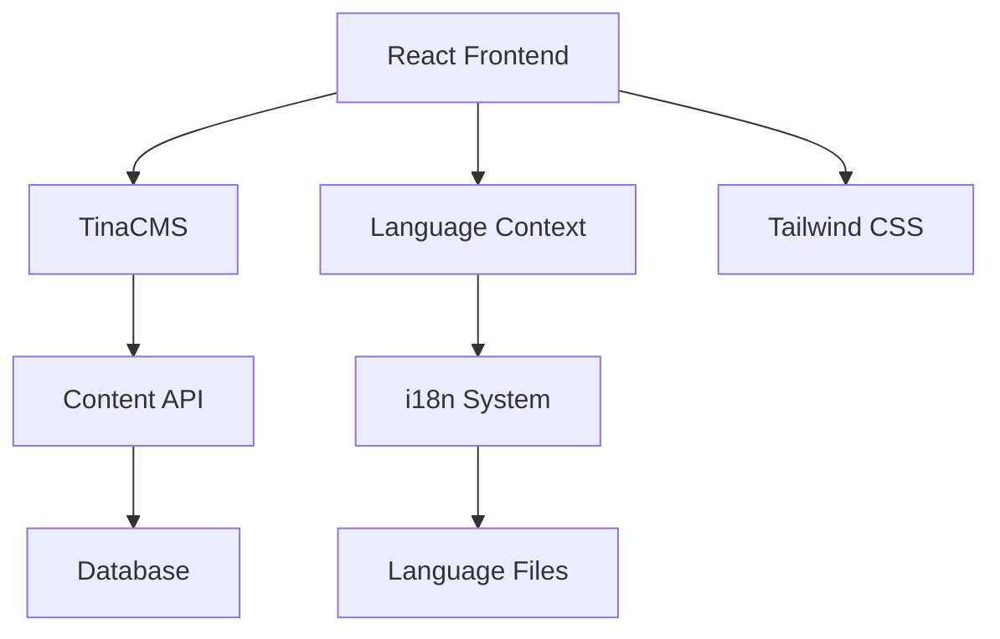

<div align="center">

# 🌱 Uyirmai
### *Bilingual Permaculture Website*


*A modern, responsive bilingual platform bridging sustainable agriculture with digital innovation*

[🌐 Live Demo](https://uyirmai.com) • [📖 Documentation](#documentation) • [🛠️ Installation](#installation)

</div>

---

## ✨ Features

<table>
<tr>
<td width="50%">

### 🌍 **Bilingual Excellence**
- **Tamil ↔ English** seamless switching
- Dynamic content transformation
- Cultural context preservation
- RTL/LTR layout adaptation

### 🎨 **Modern Design**
- **Nature-inspired** color palette
- Smooth animations & micro-interactions
- Mobile-first responsive design
- Accessibility-compliant UI

</td>
<td width="50%">

### ⚡ **Content Management**
- **TinaCMS** headless integration
- Real-time content editing
- Media management system
- Non-technical user friendly

### 🚀 **Performance**
- **Lighthouse** optimized
- Code splitting & lazy loading
- SEO-friendly architecture
- Progressive Web App ready

</td>
</tr>
</table>

---

## 🏗️ Architecture

<div align="center">



</div>

## 🛠️ Tech Stack

<div align="center">

### Frontend Framework


### Styling & UI


### Content Management


</div>

---

## 📱 Page Showcase

<table>
<tr>
<td align="center" width="33%">

<br><b>🏠 Home</b><br>
<sub>Hero banner with dynamic content</sub>
</td>
<td align="center" width="33%">

<br><b>💭 Philosophy</b><br>
<sub>Mission, vision & values</sub>
</td>
<td align="center" width="33%">

<br><b>🎯 Projects</b><br>
<sub>Interactive project gallery</sub>
</td>
</tr>
<tr>
<td align="center" width="33%">

<br><b>📝 Blog</b><br>
<sub>Rich content management</sub>
</td>
<td align="center" width="33%">

<br><b>📚 Resources</b><br>
<sub>Educational materials</sub>
</td>
<td align="center" width="33%">

<br><b>🛒 Products</b><br>
<sub>Organic product showcase</sub>
</td>
</tr>
</table>

---

## 🚀 Quick Start

### Prerequisites
```bash
node --version  # v16.0.0 or higher
npm --version   # v8.0.0 or higher
```

### Installation

1. **Clone & Setup**
   ```bash
   git clone https://github.com/VithyabavanS/uyirmai-website.git
   cd uyirmai-website
   npm install
   ```

2. **Environment Configuration**
   ```bash
   cp .env.example .env.local
   # Add your configuration variables
   ```

3. **Development Server**
   ```bash
   npm run dev
   ```
   ```
   🌐 Frontend:    http://localhost:3000
   ⚙️  Admin Panel: http://localhost:3000/admin
   ```

4. **Production Build**
   ```bash
   npm run build
   npm run preview
   ```

---

## 📂 Project Structure

```
uyirmai-website/
├── 🎨 src/
│   ├── 🧩 components/          # Reusable UI components
│   │   ├── common/            # Shared components
│   │   ├── forms/             # Form components
│   │   └── layout/            # Layout components
│   ├── 📄 pages/              # Page components
│   ├── 🌐 context/            # React contexts
│   │   ├── LanguageContext.tsx
│   │   └── ThemeContext.tsx
│   ├── 🎣 hooks/              # Custom React hooks
│   ├── 🛠️ utils/              # Utility functions
│   ├── 🎯 types/              # TypeScript definitions
│   └── 📦 assets/             # Static assets
├── 🌍 public/                 # Public assets
├── ⚙️ tina/                   # TinaCMS configuration
├── 📚 docs/                   # Documentation
└── 🔧 config/                 # Build configurations
```

---

## 🌟 Key Features Deep Dive

### 🌍 Internationalization System

```typescript
// Language Context Implementation
interface LanguageContextType {
  language: 'en' | 'ta';
  setLanguage: (lang: 'en' | 'ta') => void;
  t: (key: string, params?: Record<string, string>) => string;
}

const useLanguage = () => {
  const context = useContext(LanguageContext);
  if (!context) {
    throw new Error('useLanguage must be used within LanguageProvider');
  }
  return context;
};
```

### 📝 Content Management Workflow

```typescript
// TinaCMS Schema Example
export const pageSchema: Template = {
  name: 'page',
  label: 'Page',
  fields: [
    {
      type: 'string',
      name: 'title',
      label: 'Title',
      isTitle: true,
      required: true,
    },
    {
      type: 'rich-text',
      name: 'content',
      label: 'Content',
    },
  ],
};
```

### 🎨 Design System

<div align="center">

| Component | Purpose | Features |
|-----------|---------|----------|
| `Button` | Primary actions | Multiple variants, loading states |
| `Card` | Content containers | Hover effects, responsive layout |
| `Modal` | Overlays | Accessible, keyboard navigation |
| `Form` | Data input | Validation, error handling |

</div>

---

## 📊 Performance Metrics

<div align="center">

| Metric | Score | Target |
|--------|-------|---------|
| 🚀 **Performance** | 95+ | 90+ |
| ♿ **Accessibility** | 100 | 95+ |
| 🔍 **SEO** | 100 | 95+ |
| ✅ **Best Practices** | 95+ | 90+ |

</div>

---

## 🎯 Project Goals & Impact

<table>
<tr>
<td width="50%">

### 🌱 **Sustainability Mission**
- Promote permaculture practices
- Bridge language barriers in agriculture
- Create accessible educational resources
- Build community around sustainable farming

</td>
<td width="50%">

### 💻 **Technical Achievement**
- Modern React architecture
- Comprehensive i18n implementation
- Headless CMS integration
- Performance optimization
- Accessibility compliance

</td>
</tr>
</table>

---

## 🔮 Roadmap

- [ ] **Phase 2**: E-commerce integration
- [ ] **Phase 3**: Community forum
- [ ] **Phase 4**: Mobile application
- [ ] **Phase 5**: AI-powered recommendations
- [ ] **Phase 6**: Multi-region deployment

---

## 🤝 Contributing

We welcome contributions! Please see our [Contributing Guidelines](CONTRIBUTING.md) for details.

1. Fork the repository
2. Create your feature branch (`git checkout -b feature/AmazingFeature`)
3. Commit your changes (`git commit -m 'Add some AmazingFeature'`)
4. Push to the branch (`git push origin feature/AmazingFeature`)
5. Open a Pull Request

---

## 📜 License

This project is developed for the Uyirmai organization. All rights reserved.

---

<div align="center">

## 👨‍💻 Developer

**Vithyabavan Sunthareswaran**  
*Full Stack Developer & ML Engineer*

[](https://www.linkedin.com/in/vithyabavan-sunthareswaran/)
[](https://github.com/VithyabavanS)
[](mailto:vithyabavans2001@gmail.com)

---

### 💚 *"Technology meets sustainability. Innovation serves nature."*


</div>
